# Базы данных
## Программная инженерия
### Лекции
[Презентации](https://github.com/CandyGoose/Database_SE/tree/main/lectures)

### Лабораторные
[1 - Инфологическая и даталогическая модели, их реализация в PostgreSQL](https://github.com/CandyGoose/Database_SE/tree/main/lab1)

[2 - Запросы к базе данных "Учебный процесс"](https://github.com/CandyGoose/Database_SE/tree/main/lab2)

[3 - Функциональные зависимости и NF](https://github.com/CandyGoose/Database_SE/tree/main/lab3)

[4 - Планы выполнения запросов](https://github.com/CandyGoose/Database_SE/tree/main/lab4)

## Как работать с БД?

1. Скачиваем и устанавливаем [DataGrip](https://www.jetbrains.com/datagrip/)
2. Создаем или открываем проект
3. Слева нажимаем `+`, затем `Data Source - PostgreSQL`

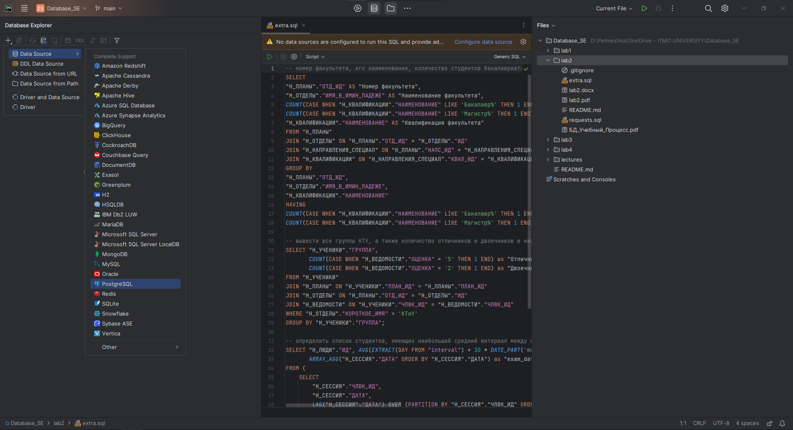

4. Нажимаем `Download` внизу, если требуется, и вводим данные:

- User: `sXXXXXX`
- Password: пароль из файла .pgpass (чтобы его получить подключитесь к гелиосу и пропишите cat .pgpass, там будет "\*:\*:*:sXXXXXX:пароль")
- Database: `studs` (или `ucheb`, смотря какая вам нужна для лабы)

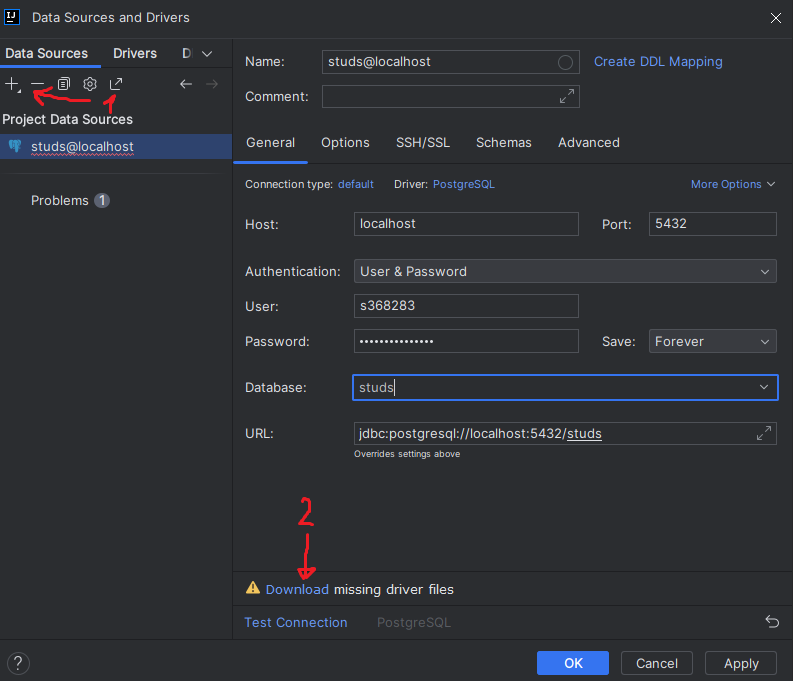

5. Идем в раздел SSH/SSL, ставим галочку, где `Use SSH tunnel` и нажимаем на три точки справа

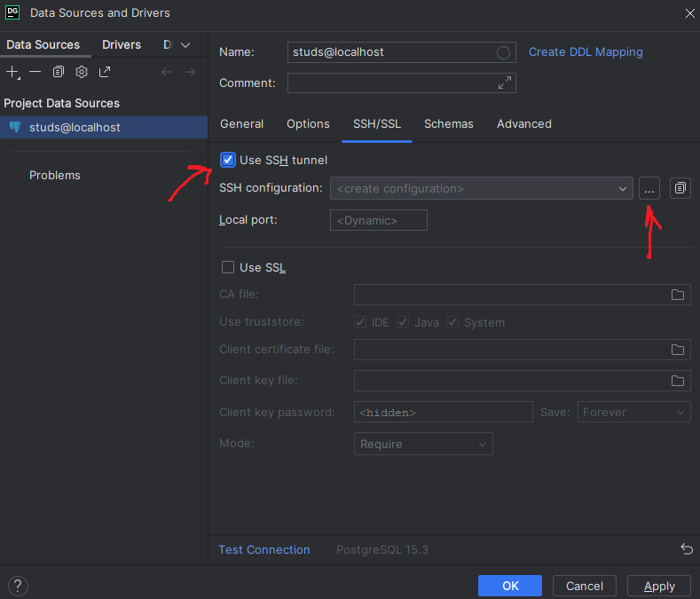

6. Здесь нажимаем `+`, далее повторяем настройки:
- Host: `se.ifmo.ru`
- Port: `2222`
- Username `sXXXXXX` (XXXXXX - ИСУ)
- Password: пароль с [se.ifmo](https://se.ifmo.ru/passwd/)

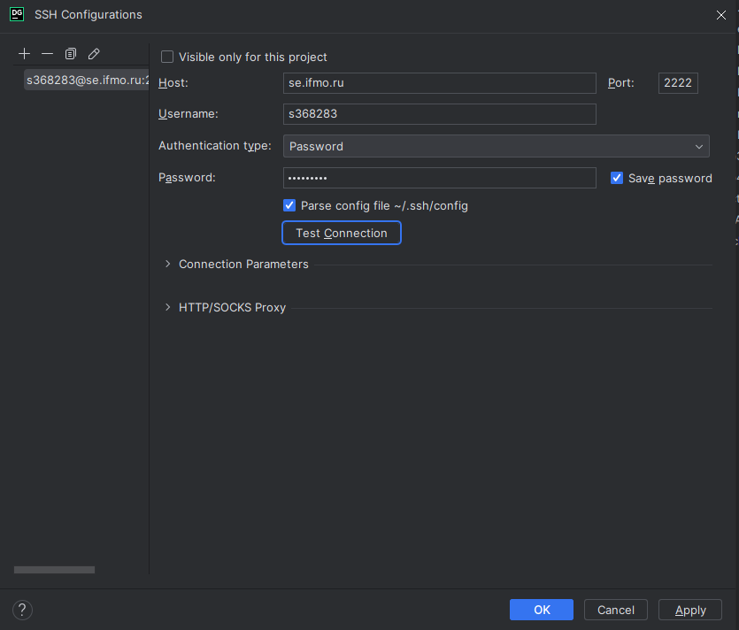

7. Нажмите `Test Connection`, если все верно, то вам выведется сообщение об успехе, нажимаем `Apply` и `OK`

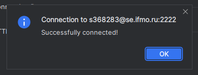

8. Возвращаемся на вкладку `General`, снизу тоже нажимаем `Test Connection`, должно появиться сообщение об успехе, если так, то нажимаем `Apply`

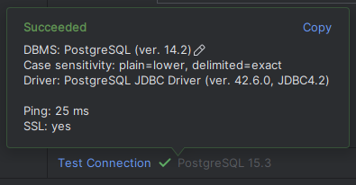

Теперь мы можем выполнять запросы

9. Откройте консоль, нажав ПКМ по `studs` (или `ucheb`), далее `New - Query Console`

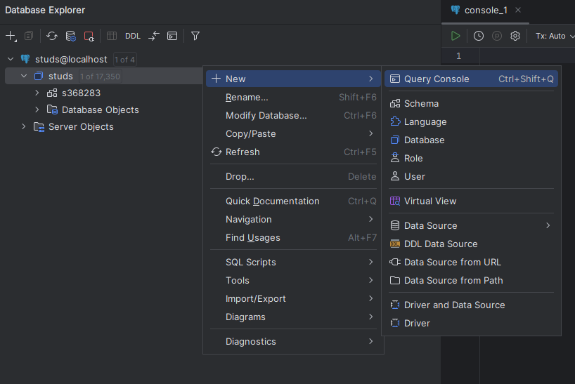

Сюда мы можем писать свои запросы, чтобы они выполнялись

10. Тестируем на простых запросах `studs`

```sql
CREATE TABLE test (
    id BIGSERIAL PRIMARY KEY,
    description TEXT NOT NULL UNIQUE
);

INSERT INTO test (description) VALUES
    ('test1'),
    ('test2');

SELECT * FROM test;
```

Чтобы выполнить запрос, переведите курсор на текст запроса (нажмите на него, должна появиться зеленая рамочка вокруг), а затем сверху нажмите на значок Execute (зеленый треугольник, Play), появится меню, где вы можете выбрать: __выполнить только запрос в зеленой рамочке или все запросы в консоли__ 

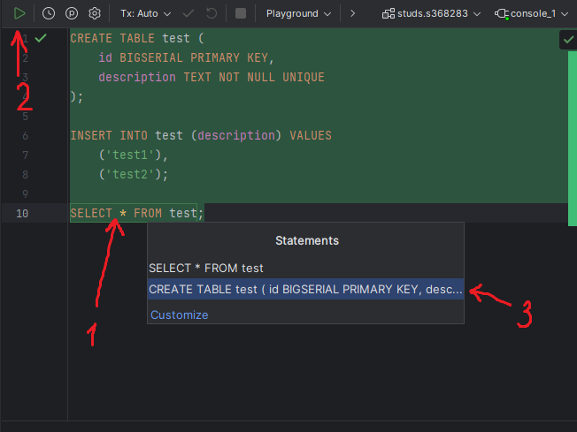

После выполнения запросов снизу появится результат:

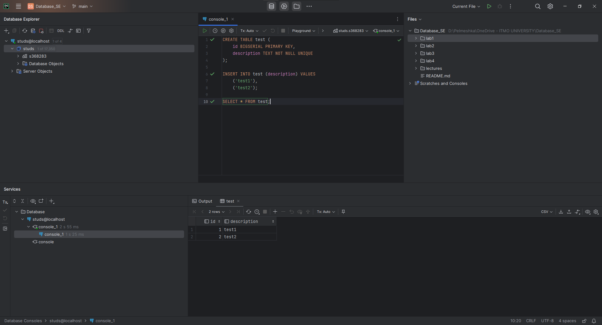

\* Чтобы удалить таблицу, можно прописать в консоли:

```sql
DROP TABLE test;
```

Или выбрать слева соответствующий пункт:

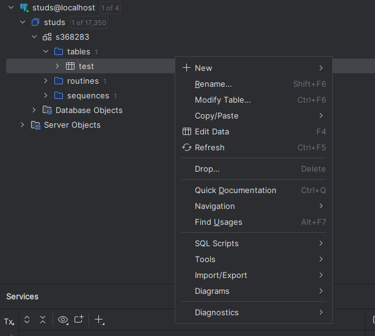

11. Тестируем на простом запросе `ucheb` (можно просто поменять название БД в 4 пункте, также необходимо открыть новую консоль)

```sql
SELECT * FROM "Н_ЛЮДИ";
```

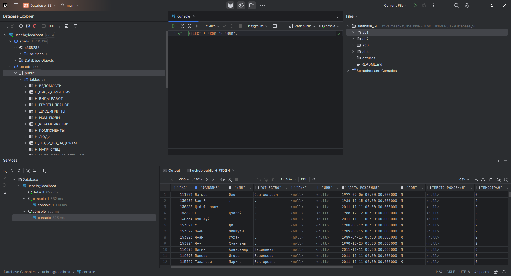

Успех!

## Как работать с БД на Helios?

Если вам по каким-то причинами удобнее работать на гелиосе, а не по методу описанному выше, то давайте разберемся

1. Для начала создайте новый файл, у меня `test.sql` и наполните его каким-нибудь содержимым (или создайте новый файл прямо на гелиосе, переходите сразу к пункту 3). Например:
```sql
CREATE TABLE test (
    id BIGSERIAL PRIMARY KEY,
    description TEXT NOT NULL UNIQUE
);

INSERT INTO test (description) VALUES
    ('test1'),
    ('test2');

SELECT * FROM test;
```
Закиньте файл с запросом на Helios, находясь в директории, где он лежит
```
scp -P 2222 test.sql sXXXXXX@helios.cs.ifmo.ru:~/
```
2. Поключитель к Helios
```
ssh sXXXXXX@helios.cs.ifmo.ru -p 2222
```
3. Создайте файл с запросом (если вы решили не выполнять 1-2 пункты, иначе пропустите этот пункт)
- Создайте новый файл:
```
touch test.sql
```
- Откройте редактор:
```
vi test.sql
```
- Впишите сюда содержимое запроса, например, из 1 пункта (чтобы начать писать в виме, нажмите клавишу `i`)
- Чтобы сохранить файл и выйти из редактора, надо нажать `Esc` и набрать `:wq` (иногда требуется поставить ! в конце), `Enter`. Если вы хотите выйти без сохранения наберите `:q!`

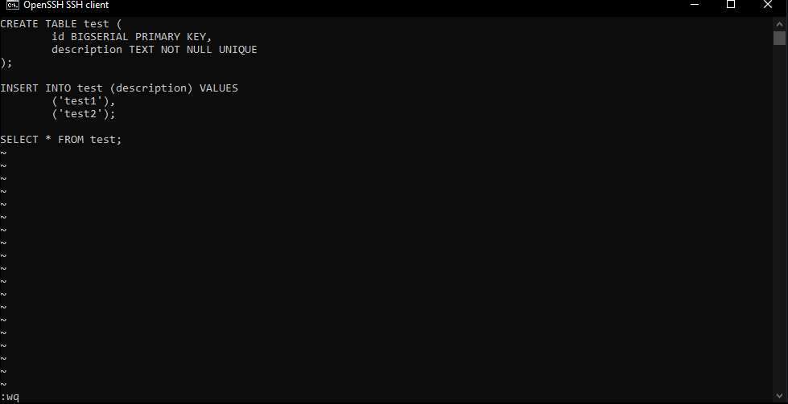

5. Пропишите
```
psql -h pg -d studs
```
или 
```
psql -h pg -d ucheb
```
Смотря какая лаба

5. Основные команды:
- `\i test.sql` - выполнить запросы из файла
- `\d` - посмотреть все существующие таблицы и тд.
- `\h` - посмотреть справку по SQL операторам
- `\?` - посмотреть справку по другим командам
- `\q` - выйти из psql

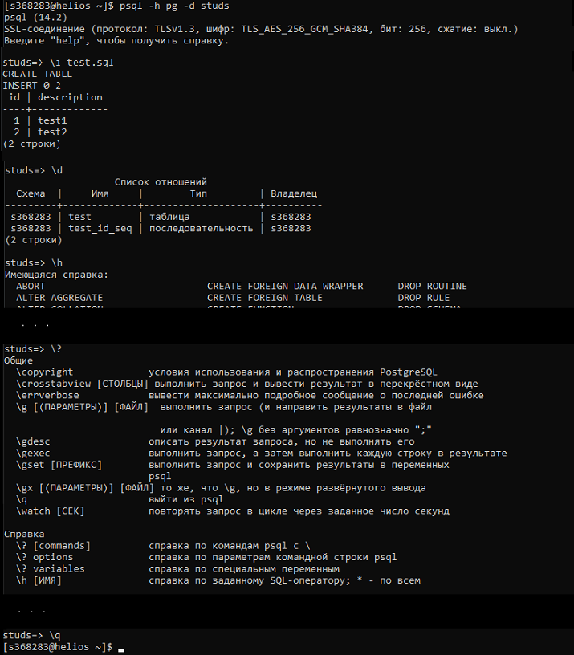
